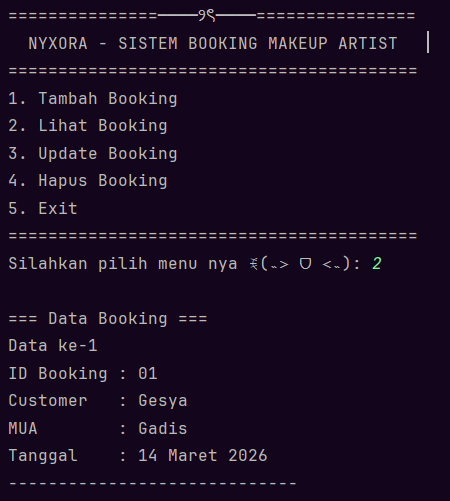

# ── ⋆⋅☆⋅⋆ ── Sistem Booking Makeup Artist ── ⋆⋅☆⋅⋆ ──

### Posttest 3 - Praktikum Pemrograman Berorientasi Objek (PBO)

---

## ⸜(｡˃ ᵕ ˂ )⸝♡ Deskripsi Program

Program **Sistem Booking Makeup Artist** adalah aplikasi berbasis **console** yang dibuat menggunakan bahasa pemrograman **Java** dengan konsep **Object-Oriented Programming (OOP)**.

Program ini digunakan untuk mengelola data **booking jasa makeup artist** dengan fitur **CRUD (Create, Read, Update, Delete)**.
Pengguna dapat menambahkan, melihat, mengubah, dan menghapus data booking melalui menu yang tersedia di program.

Pada **Posttest 3**, program ini dikembangkan dengan menambahkan **konsep Inheritance (Pewarisan)**.

---

## (˶˃𐃷˂˶) Tujuan Program

Tujuan dari pembuatan program ini adalah untuk:

* Menerapkan konsep **Encapsulation**
* Menggunakan Access **Modifier**
* Mengimplementasikan **Getter dan Setter**
* Menerapkan konsep **Inheritance**
* Mengelola data booking menggunakan konsep **OOP**

---

## ◝(ᵔᗜᵔ)◜ Konsep OOP yang Digunakan

Pada **Posttest 3**, program ini menerapkan konsep:

🔹 Encapsulation
- Mengubah atribut pada class menjadi **private/protected**
- Mengakses data menggunakan **getter**
- Mengubah data menggunakan **setter**

🔹Inheritance
- Menggunakan keyword **extends**
- Membuat hubungan antar class dengan konsep **is-a**

---

## (∩˃o˂∩)♡ Penjelasan Class

### 1️⃣ Main.java

Class utama yang berfungsi untuk menjalankan program dan menampilkan menu kepada pengguna.

### 2️⃣ Booking.java

Class yang menyimpan data booking seperti:

* ID Booking
* Nama Customer
* Nama Makeup Artist
* Tanggal Booking

Pada class ini diterapkan **Encapsulation dengan getter dan setter**.

### 3️⃣ Customer.java (subclass)

Class yang menyimpan data customer seperti:

* ID Customer
* Nama Customer
* Nomor HP

### 4️⃣ MakeupArtist.java (subclass)

Class yang menyimpan data makeup artist seperti:

* ID MUA
* Nama MUA
* Spesialisasi
* Harga layanan

### 5️⃣ User.java (superclass) 

Class induk yang menyimpan data umum:

* ID
* Nama

---

## (˶˃𐃷˂˶) Tipe Inheritance yang Digunakan
Program ini menggunakan **Hierarchical Inheritance**, yaitu satu superclass *(User)* memiliki lebih dari satu subclass *(Customer dan MakeupArtist)*.

---

## ദ്ദി◝ ⩊ ◜.ᐟ Fitur Program

Program ini memiliki beberapa fitur utama:

1. **Create Booking**
   Menambahkan data booking baru.

2. **Read Booking**
   Menampilkan daftar booking yang tersedia.

3. **Update Booking**
   Mengubah data booking yang sudah ada.

4. **Delete Booking**
   Menghapus data booking dari sistem.

---

## (*ᴗ͈ˬᴗ͈)ꕤ*.ﾟ Tampilan Program

### Menu Utama

### Menambah Booking

### Menampilkan Data Booking

### Mengedit Data Booking

### Menghapus Data Booking

### Exit Sistem Data Booking

---

## ₍^. .^₎Ⳋ  Identitas

Nama : Gadis Wulandari

NIM : 2409106026

Kelas : A'2 2024

---

## (๑ᵔ⤙ᵔ๑) Kesimpulan

Program ini merupakan pengembangan dari **Posttest 2** dengan menambahkan konsep **Inheritance** dalam OOP.

Dengan adanya inheritance, program menjadi lebih **terstruktur** dan mengurangi **duplikasi kode**, karena class **Customer** dan **MakeupArtist** mewarisi atribut dari class **User**.

---

ദ്ദി(˵ •̀ ᴗ - ˵ ) ✧ Dibuat untuk memenuhi tugas **Posttest 3 Praktikum PBO**
