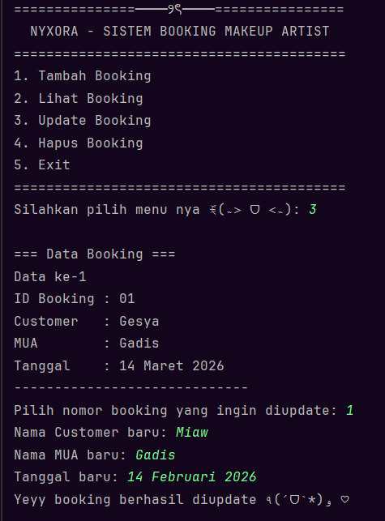
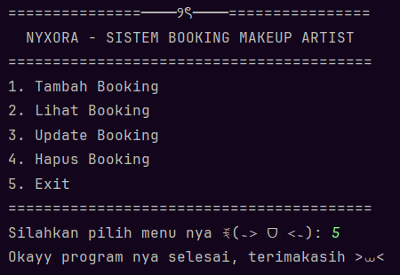

# ── ⋆⋅☆⋅⋆ ── Sistem Booking Makeup Artist ── ⋆⋅☆⋅⋆ ──

### Posttest 5 - Praktikum Pemrograman Berorientasi Objek (PBO)

---

## ⸜(｡˃ ᵕ ˂ )⸝♡ Deskripsi Program

Program **Sistem Booking Makeup Artist** adalah aplikasi berbasis **console** yang dibuat menggunakan bahasa pemrograman **Java** dengan konsep **Object-Oriented Programming (OOP)**.

Program ini digunakan untuk mengelola data **booking jasa makeup artist** dengan fitur **CRUD (Create, Read, Update, Delete)**.
Pengguna dapat menambahkan, melihat, mengubah, dan menghapus data booking melalui menu yang tersedia di program.

Pada **Posttest 5**, program ini dikembangkan dengan menambahkan konsep **Abstraction (Abstract Class & Interface)**.

---

## (˶˃𐃷˂˶) Tujuan Program

Tujuan dari pembuatan program ini adalah untuk:

* Menerapkan konsep **Encapsulation**
* Menggunakan Access **Modifier**
* Mengimplementasikan **Getter dan Setter**
* Menerapkan konsep **Inheritance**
* Menerapkan konsep **Polymorphism**
* Menerapkan konsep **Abstraction (Abstract Class & Interface)**
* Mengelola data booking menggunakan konsep **OOP**

---

## ◝(ᵔᗜᵔ)◜ Konsep OOP yang Digunakan

Program ini menerapkan beberapa konsep utama dalam OOP, yaitu:

---

### 🔹 Encapsulation

* Mengubah atribut pada class menjadi **private/protected**
* Mengakses data menggunakan **getter**
* Mengubah data menggunakan **setter**

---

### 🔹 Inheritance

* Menggunakan keyword **extends**
* Membuat hubungan antar class dengan konsep **is-a**

Contoh:

* `Customer` dan `MakeupArtist` merupakan turunan dari `User`

---

### 🔹 Polymorphism

**1. Overloading (Static Polymorphism)**

* Method dengan nama sama tetapi parameter berbeda

Contoh:
public Booking(String id, String customer, String mua, String tanggal)
public Booking(String id, String customer, String mua, String tanggal, String catatan)

public void setTanggal(String tanggal)
public void setTanggal(int hari, int bulan, int tahun)

---

**2. Overriding (Dynamic Polymorphism)**

* Method dari superclass ditulis ulang di subclass

Contoh:
// di superclass (abstract)
public abstract void tampilInfo();

// di subclass
@Override
public void tampilInfo()

---

### 🔹 Abstraction

Abstraction digunakan untuk menyembunyikan detail implementasi dan hanya menampilkan fungsi penting dari suatu objek.

#### ✔ Abstract Class

* Class `User` diubah menjadi **abstract class**
* Tidak dapat dibuat objek secara langsung
* Memiliki abstract method `tampilInfo()`

#### ✔ Interface

* Dibuat interface `Transaksi`

* Berisi method tanpa body:

   * `prosesBooking()`
   * `tampilRingkasan()`

* Diimplementasikan pada:

   * Customer
   * MakeupArtist
   * Booking

---

## (∩˃o˂∩)♡ Penjelasan Class

### 1️⃣ Main.java

Class utama yang berfungsi untuk menjalankan program dan menampilkan menu kepada pengguna.

---

### 2️⃣ Booking.java

Class yang menyimpan data booking seperti:

* ID Booking
* Nama Customer
* Nama Makeup Artist
* Tanggal Booking

Konsep yang digunakan:

* Encapsulation
* Overloading
* Interface

---

### 3️⃣ Customer.java (Subclass)

Class yang menyimpan data customer:

* ID Customer
* Nama Customer
* Nomor HP

Konsep:

* Inheritance
* Overriding
* Interface

---

### 4️⃣ MakeupArtist.java (Subclass)

Class yang menyimpan data makeup artist:

* ID MUA
* Nama MUA
* Spesialisasi
* Harga layanan

Konsep:

* Inheritance
* Overriding
* Interface

---

### 5️⃣ User.java (Abstract Class)

Class induk yang menyimpan data umum:

* ID
* Nama

Memiliki method:

* `tampilInfo()`

---

### 6️⃣ Transaksi.java (Interface)

Interface sebagai kontrak untuk proses transaksi.

Method:

* `prosesBooking()`
* `tampilRingkasan()`

---

## (˶˃𐃷˂˶) Tipe Inheritance yang Digunakan

Program ini menggunakan **Hierarchical Inheritance**, yaitu satu superclass *(User)* memiliki lebih dari satu subclass *(Customer dan MakeupArtist)*.

---

## ദ്ദി◝ ⩊ ◜.ᐟ Fitur Program

1. **Create Booking**
2. **Read Booking**
3. **Update Booking**
4. **Delete Booking**

---

## (*ᴗ͈ˬᴗ͈)ꕤ*.ﾟ Tampilan Program

### Menu Utama

### Menambah Booking

### Menampilkan Data Booking

### Mengedit Data Booking

### Menghapus Data Booking

### Exit Sistem Data Booking

---

## ₍^. .^₎Ⳋ Identitas

Nama : Gadis Wulandari
NIM : 2409106026
Kelas : A'2 2024

---

## (๑ᵔ⤙ᵔ๑) Kesimpulan

Program ini merupakan pengembangan dari posttest sebelumnya dengan menambahkan konsep **Abstraction (Abstract Class dan Interface)**.

Dengan adanya abstraction:

* Program menjadi lebih terstruktur
* Lebih mudah dikembangkan
* Memiliki standar method yang konsisten melalui interface

---

ദ്ദി(˵ •̀ ᴗ - ˵ ) ✧ Dibuat untuk memenuhi tugas **Posttest 5 Praktikum PBO**
